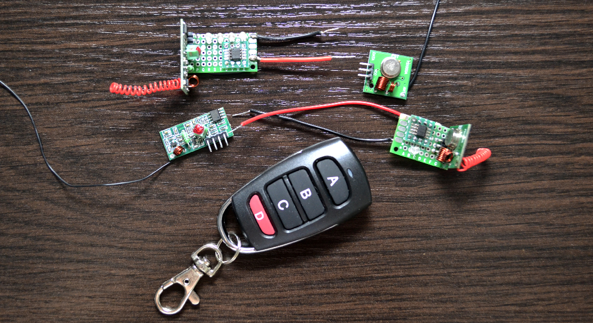

# TinyRF

A simple and lightweight library for remote control or data exchange between ATtiny13, ATtiny85 and some other cheap ATtiny microcontrollers.



# Key features

+ Can transmit and receive messages up to 255 bytes
+ Small enough to fit in ATtiny13 with 1024 bytes of flash (even transmitter and receiver at the same time!)
+ Compatible with ATtiny13/ATtiny13A, ATtiny85 (Digispark) and can be easily ported to any other AVR with at least one hardware timer
+ Compatible with some protocols of the [RC-Switch library](https://github.com/sui77/rc-switch) and can be used to interact with other Arduino based projects
or operate some remote radio controlled devices

# Basic usage

## Transmitter

```c
// Step 1: define some params (see description below)

#define F_CPU           1200000UL   // Clock speed in Hz
#define TRF_TX_PIN      PB1         // Transmitter pin (default is PB0)
#define TRF_DATA_SIZE   2           // Message size in bytes (default is 3)
#define TRF_RX_DISABLED             // Exclude receiver code to preserve space (optional)

// Step 2: include TinyRF header file

#include "tinyrf.h"

// Step 3: call the initializer at the beginning of your program if your code never changes
// the timer, interrupt and port direction settings, otherwise call the initializer each time
// you want to send the message

trf_init();

// Step 4: prepare the message and transmit it

uint8_t message[TRF_DATA_SIZE] = { 123, 234 };
trf_send(message);
```

See [examples](/examples) for more details.

## Receiver

```c
// Step 1: define some params (see description below)

#define F_CPU           1200000UL   // Clock speed in Hz
#define TRF_RX_PIN      PB0         // Receiver pin (default is PB1)
#define TRF_DATA_SIZE   2           // Message size in bytes (default is 3)
#define TRF_TX_DISABLED             // Exclude transmitter code to preserve space (optional)

// Step 2: include TinyRF header file

#include "tinyrf.h"

// Step 3: call the initializer at the beginning of your program if your code never changes
// the timer, interrupt and port direction settings, otherwise call the initializer each time
// you want to start receiving messages

trf_init();

// Step 4: check if a new message is available:

if (trf_has_received_data()) {

    // Step 5: prepare the buffer and copy the message

    uint8_t data_buffer[TRF_DATA_SIZE];
    trf_get_received_data(data_buffer);

    // Step 6: check the message and do whatever you need to do

    if (data_buffer[0] == 123 && data_buffer[1] == 234) {
        ...
    }

    // Step 7: reset state to continue looking for messages

    trf_reset_received();
}
```

See [examples](/examples) for more details.

## Customizable parameters

Here is a list of some params you can define in your program to change library settings. You must place them **before** including the library header file.

#### Common settings

|Param name|Description|Required|Default value|
|:---------|:----------|:------:|:------------|
|F_CPU|Clock speed in Hz|Yes|Not defined|
|TRF_DATA_SIZE|Message size in bytes|No|3 bytes|
|TRF_RX_DISABLED|Excludes receiver code to save extra memory|No|Not defined|
|TRF_RX_PIN|Receiver pin|No|PB1|
|TRF_TX_DISABLED|Excludes transmitter code to save extra memory|No|Not defined|
|TRF_TX_PIN|Transmitter pin|No|PB0|
|TRF_TX_REPEAT_COUNT|Defines message transmit repeats count. Recommended value is >= 10|No|10|

#### Protocol settings

|Param name|Description|Required|Default value|
|:---------|:----------|:------:|:------------|
|TRF_PULSE_WIDTH|Pulse length in microseconds|No|350 us|
|TRF_SYNC_HIGH_PULSES|Sync bit HIGH impulses count|No|1|
|TRF_SYNC_LOW_PULSES|Sync bit LOW impulses count|No|31|
|TRF_ONE_HIGH_PULSES|ONE bit HIGH impulses count|No|3|
|TRF_ONE_LOW_PULSES|ONE bit LOW impulses count|No|1|
|TRF_ZERO_HIGH_PULSES|ZERO bit HIGH impulses count|No|1|
|TRF_ZERO_LOW_PULSES|ZERO bit LOW impulses count|No|3|

# Please note

+ This library does not perform any data consistency check, so you will have to implement your own logic to make sure you are getting the correct data
+ The longer the message, the less likely it will be successfully received due to noise and interference. Optimal message size is 2-4 bytes
+ The internal oscillator of ATtiny microcontrollers may be very inaccurate, so you may need to adjust F_CPU or TRF_PULSE_WIDTH params to achieve reliable data reception

# Ways to support me

If you liked my project, feel free to say "Thank you" :blush:

|PayPal|Yandex.Money|
|:----:|:----------:|
|[](https://www.paypal.me/sinuxvr)|[](https://money.yandex.ru/to/410014808100617)|