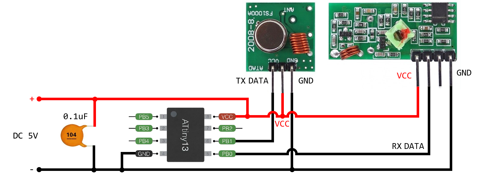
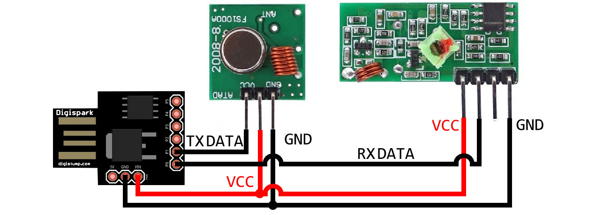

## Echo repeater example

A simple example demonstrating the simultaneous use of a receiver and transmitter with the same MCU. Principle of operation:

+ Waits for a 2-byte command (see transmitter code in [led-control](../led-control) example)
+ Transmits it again with a delay of 2 seconds

### ATtiny13 schematics

### Digispark schematics

