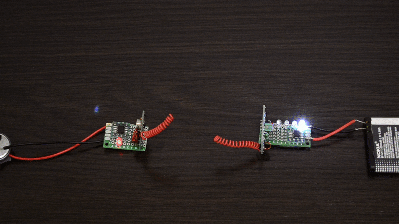
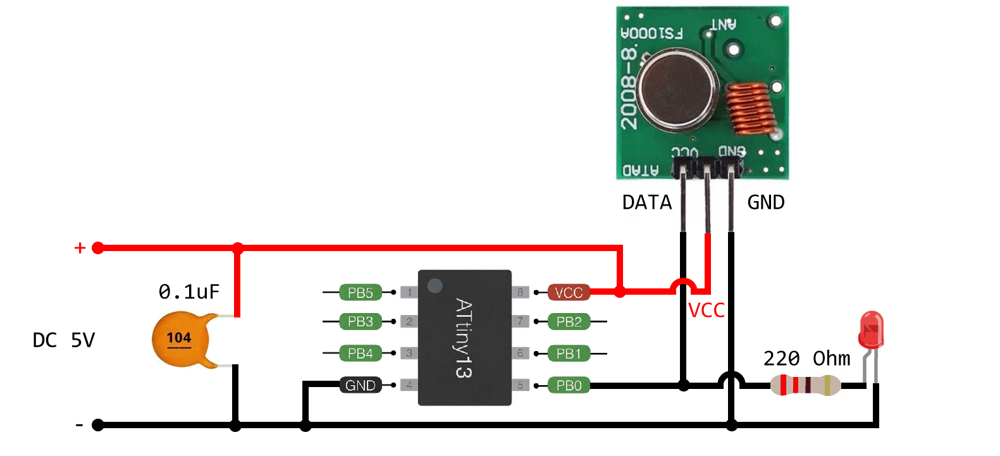
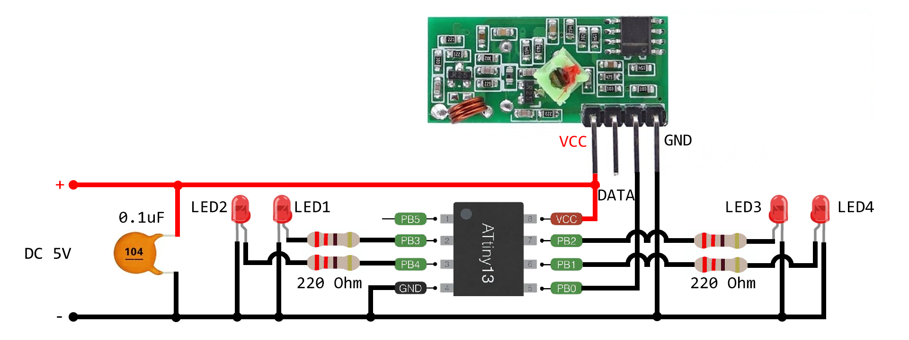
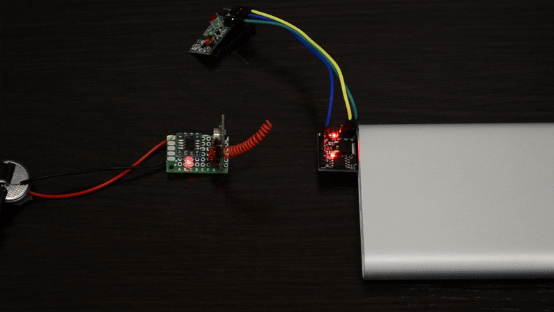
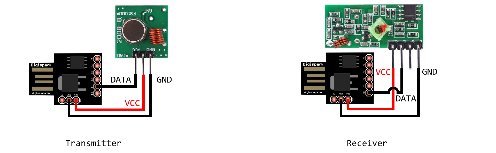

## LED control example

A simple example showing how to send and receive commands to toggle LEDs

### ATtiny13

+ Transmitter sends 8 different 2-byte commands sequentially with 500ms delay
+ Receiver has 8 LEDs, each LED switches regardless of the others depending on the command received

#### Transmitter

#### Receiver

### Digispark

+ Transmitter sends 8 different 2-byte commands sequentially with a 500ms delay, just like the ATtiny13 version
+ Receiver switches the built-in Digispark LED depending on the command received

#### Schematics

